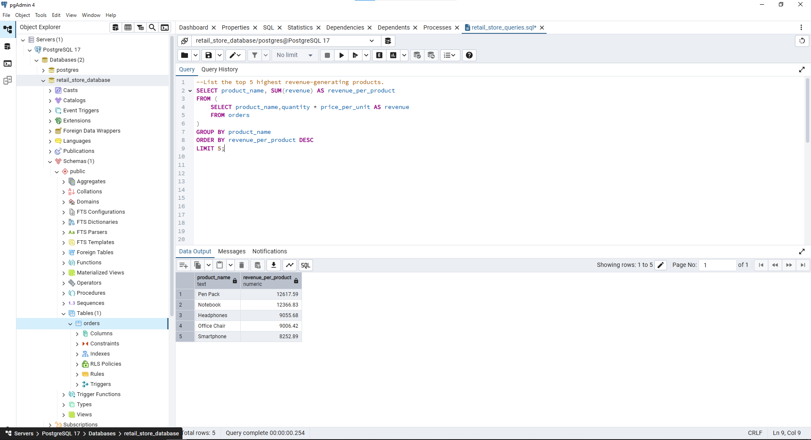
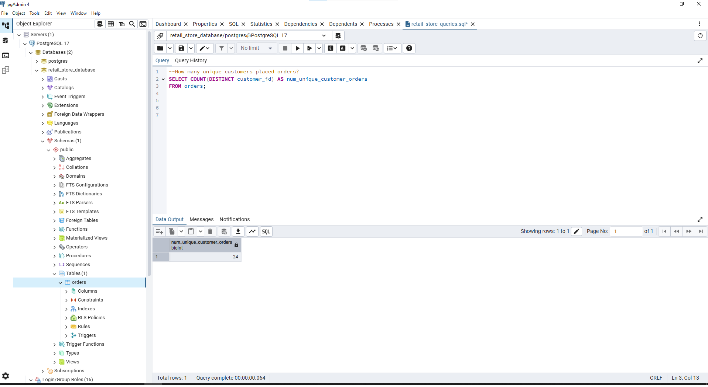
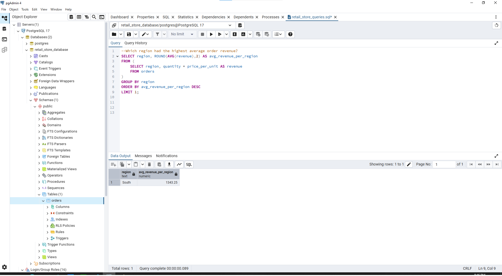

# 📊SQL Project: Sales Insights: Analyzing a Retail Store’s Orders
Welcome to my SQL beginner project! This is ahands-on project designed to strengthen my SQL skills through data exploration, querying, and basic analysis.
## 📁 Project Overview
### Objective:

The goal of this project is to analyze a fictitious retail store database by answering the following questions through SQL.
- What is the total number of orders placed?
- How many orders were made in each region?
- Which product category had the highest number of orders?
- How many total units were sold for each product?
- Which day had the highest number of orders placed?
- What is the total revenue per region?
- List the top 5 highest revenue-generating products.
- What is the average order quantity per product category?
- How many unique customers placed orders?
- Which region had the highest average order revenue?

### Skills used:

- SELECT statements
- Filtering with WHERE
- Aggregations (GROUP BY, HAVING)
- Subqueries
- Sorting and limiting data

## 🧰 Tools & Technologies

- SQL Flavor: PostgreSQL
- Database Tool: pgAdmin
- Data Source: order_dataset.csv

## 🔨 Project Setup
### About the Data
For demo and simplicity purposes, the dataset used for this project is generated using ChatGPT. The generated dataset consists of 50 rows with the following fields

| Column name | Data Type | Description |
|--------|--------|--------|
| order_id | INTEGER | Unique ID for each order |
| customer_id | INTEGER | ID of the customer placing the order |
| order_date |	DATE |	Date the order was placed |
| product_category | TEXT | Category of the product |
| product_name | TEXT |	Name of the product |
| quantity | INTEGER | Number of units ordered |
| price_per_unit | FLOAT | Price per single unit of the product |
| region | TEXT | Region where the order was made |

### Data Preparation
The orders_dataset.csv dataset does not have correct data type for most of its columns. This can be corrected by changing its data type on the Number Format using Excel.

**order_id**


**customer_id**


**order_date**


**product_category**


**product_name**


**quantity**


**price_per_unit**


**region**


### Creating the database

With **orders_dataset.csv** being prepared, its ready to be load to a database to which we can perform queries. But first we need to create this database using pgAdmin tool. Name this database as **retail_store_database**.


Under the **definitions** tab, let the value of encoding field stay to its default value of **UTF8**.


### Creating the table

Now that **retail_store_database** is created. The next step is to create a table within it. name this table as **orders**.


We want to make sure that each column of **orders** has the same data type with its corresponding column in the **orders_dataset.csv** that we prepared earlier. This is to avoid error once we start loading the csv file to the **retail_store_database**.


### Importing the data

After creating the table with its appropriate columns' data type, we can now load the contents of **orders_dataset.csv** on it. On the **orders** table of **retail_store_database**, right-click on it and select **Import/Export Data** option.


Under the **General** tab, choose **import** on the toggle. For the **filename** field, browse on the file location of **orders_dataset.csv** file. For the **Format** and **Encoding** field, choose **csv** (orders_dataset file type) and **UTF8**, respectively.


Under the **Options** tab, turn on **Header** toggle. Since the dataset to be imported  is a csv (comma separated value) file, choose **,** as the **Delimiter**.


Lastly, under the **Columns** tab, check the **Columns to export** if the values matches the columns of the dataset to be imported as well as the columns of the previously created **orders** table. Once check, click **OK**. 


If the importing of data becomes successful, you'll see a notification like this.


## ✍️ Writing the queries

Now that the records of **orders_dataset.csv** has been loaded to **orders** table, we can proceed with the analysis of the retail store's sales in order to answer the following questions stated previously by writing SQL queries. Under **Tables**, right-click on **orders** and choose **Query Tool**. 


This will show the space under **retail_store_database** where the queries can be written and run.


The next series of code and images are the queries for each of the following questions.

### Question 1: What is the total number of orders placed?

**Code:**

```sql
--What is the total number of orders placed?
SELECT COUNT(order_id) AS total_num_orders
FROM orders;
```

**Result:**


### Question 2: How many orders were made in each region?

**Code:**

```sql
--How many orders were made in each region?
SELECT region, COUNT(order_id) AS num_orders
FROM orders
GROUP BY region;
```

**Result:**


### Question 3: Which product category had the highest number of orders?

**Code:**

```sql
--Which product category had the highest number of orders?
SELECT product_category, COUNT(order_id) AS number_orders
FROM orders
GROUP BY product_category
ORDER BY number_orders DESC;
```

**Result:**


### Question 4: How many total units were sold for each product?

**Code:**

```sql
--How many total units were sold for each product?
SELECT product_name, COUNT(order_id) AS number_units_sold
FROM orders
GROUP BY product_name;
```

**Result:**


### Question 5: Which day had the highest number of orders placed?

**Code:**

```sql
--Which day had the highest number of orders placed?
SELECT order_date, COUNT(order_id) AS num_orders
FROM orders
GROUP BY order_date
ORDER BY num_orders DESC
LIMIT 1;
```

**Result:**


### Question 6: What is the total revenue per region?

**Code:**

```sql
--What is the total revenue per region? (Revenue = quantity × price_per_unit)
SELECT region, SUM(revenue) AS revenue_per_region
FROM (
	SELECT region, quantity * price_per_unit AS revenue
	FROM orders
)
GROUP BY region;
```

**Result:**


### Question 7: List the top 5 highest revenue-generating products.

**Code:**

```sql
--List the top 5 highest revenue-generating products.
SELECT product_name, SUM(revenue) AS revenue_per_product
FROM (
	SELECT product_name,quantity * price_per_unit AS revenue
	FROM orders
)
GROUP BY product_name
ORDER BY revenue_per_product DESC
LIMIT 5;
```

**Result:**



### Question 8: What is the average order quantity per product category?

**Code:**

```sql
--What is the average order quantity per product category?
SELECT product_category, ROUND(AVG(quantity),2) AS avg_order_quantity_per_product_category
FROM orders
GROUP BY product_category;
```

**Result:**


### Question 9: How many unique customers placed orders?

**Code:**

```sql
--How many unique customers placed orders?
SELECT COUNT(DISTINCT customer_id) AS num_unique_customer_orders
FROM orders;
```

**Result:**



### Question 10: Which region had the highest average order revenue?

**Code:**

```sql
--Which region had the highest average order revenue?
SELECT region, ROUND(AVG(revenue),2) AS avg_revenue_per_region
FROM (
	SELECT region, quantity * price_per_unit AS revenue
	FROM orders
)
GROUP BY region
ORDER BY avg_revenue_per_region DESC
LIMIT 1;
	
```

**Result:**



## 📝 Summary of Results:
After executing queries on the **retail_store_database**, the following results were obtained:
- A total of **50** orders were placed on the products of the retail store.
- The retail store processed orders across four regions as follows:
	- **South** Region: **11** orders
	- **West** Region: **12** orders
	- **North** Region: **15** orders
	- **East** Region: **12** orders
- The products under **Electronics** had the most number of orders, with the total of **21** orders.
- The retail store recorded the following product sales:
	- **Notebook**: **11** units
	- **Office Chair**: **6** units
	- **Desk Lamp**: **3** units
	- **Smartphone**: **7** units
	- **Pen Pack**: **9** units
	- **Headphones**: **10** units
	- **Laptop**: **4** units
- The retail store had the most number of orders placed on its products on **March 30, 2024**.
- The retail store generated the following revenue across each region:
	- **South** Region: **$14,775.77**
	- **West** Region: **$15,337.93**
	- **North** Region: **$18,641.08**
	- **East** Region: **$14,418.67**
- The top 5 highest	revenue-generating products are as follows:
	- **Pen Pack**: **$12,617.59**
	- **"Notebook"**: **$12,366.83**
	- **"Headphones"**: **$9,055.68**
	- **"Office Chair"*: **$9,006.42**
	- **"Smartphone"**: **$8,252.89**
- The average order quantity per product category are as follows:
	- **Furniture**: **2.89** orders
	- **Electronics**: **3.10** orders
	- **Stationery**: **2.70** orders
- There were **24** unique placed orders made by customers on the retail store.
- The **Southern** region made the highest average order revenue, with the amount of **$1,343.25**.
	


