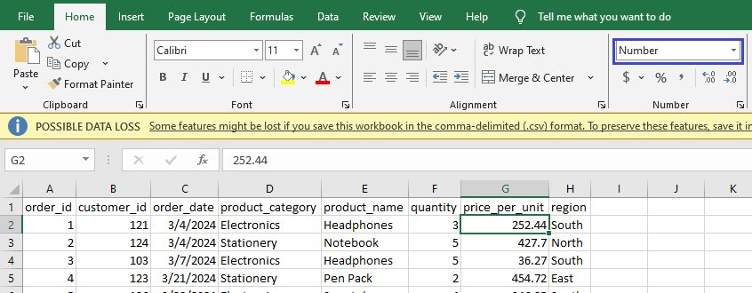
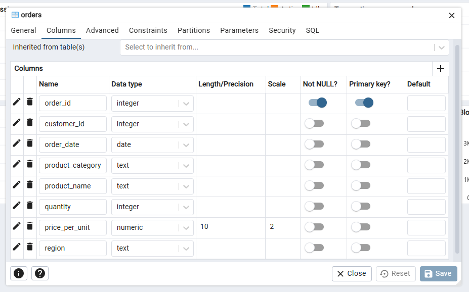

# 📊SQL Project: Sales Insights: Analyzing a Retail Store’s Orders
Welcome to my SQL beginner project! This is ahands-on project designed to strengthen my SQL skills through data exploration, querying, and basic analysis.
## 📁 Project Overview
### Objective:

The goal of this project is to analyze a fictitious retail store database by answering the following questions through SQL.
- What is the total number of orders placed?
- How many orders were made in each region?
- Which product category had the highest number of orders?
- How many total units were sold for each product?
- Which day had the highest number of orders placed?
- What is the total revenue per region?
- List the top 5 highest revenue-generating products.
- What is the average order quantity per product category?
- How many unique customers placed orders?
- Which region had the highest average order revenue?

### Skills used:

- SELECT statements
- Filtering with WHERE
- Aggregations (GROUP BY, HAVING)
- Subqueries
- Sorting and limiting data

## 🧰 Tools & Technologies

- SQL Dialect: PostgreSQL
- Database Tool: pgAdmin
- Data Source: order_dataset.csv

## 🔨 Project Setup
### About the Data
For demo and simplicity purposes, the dataset used for this project is generated using ChatGPT. The generated dataset consists of 50 rows with the following fields

| Column name | Data Type | Description |
|--------|--------|--------|
| order_id | INTEGER | Unique ID for each order |
| customer_id | INTEGER | ID of the customer placing the order |
| order_date |	DATE |	Date the order was placed |
| product_category | TEXT | Category of the product |
| product_name | TEXT |	Name of the product |
| quantity | INTEGER | Number of units ordered |
| price_per_unit | FLOAT | Price per single unit of the product |
| region | TEXT | Region where the order was made |

### Data Preparation
The orders_dataset.csv dataset does not have correct data type for most of its columns. This can be corrected by changing its data type on the Number Format using Excel.

**order_id**

**customer_id**

**order_date**

**product_category**

**product_name**

**quantity**

**price_per_unit**

**region**

### Creating the database

With **orders_dataset.csv** being prepared, its ready to be load to a database to which we can perform queries. But first we need to create this database using pgAdmin tool. Name this database as **retail_store_database**.

Under the **definitions** tab, let the value of encoding field stay to its default value of **UTF8**.

### Creating the table

Now that **retail_store_database** is created. The next step is to create a table within it. name this table as **orders**.

We want to make sure that each column of **orders** has the same data type with its corresponding column in the **orders_dataset.csv** that we prepared earlier. This is to avoid error once we start loading the csv file to the **retail_store_database**.

### Importing the data

After creating the table with its appropriate columns' data type, we can now load the contents of **orders_dataset.csv** on it. On the **orders** table of **retail_store_database**, right-click on it and select **Import/Export Data** option.

Under the **General** tab, choose **import** on the toggle. For the **filename** field, browse on the file location of **orders_dataset.csv** file. For the **Format** and **Encoding** field, choose **csv** (orders_dataset file type) and **UTF8**, respectively.

Under the **General** tab, turn on **Header** toggle. Since the dataset to be imported  is a csv (comma separated value) file, choose **,** as the **Delimiter**.

Lastly, under the **Columns** tab, check the **Columns to export** if the values matches the columns of the dataset to be imported as well as the columns of the previously created **orders** table. Once check, click **OK**. 

If the importing of data becomes successful, you'll see a notification like this.

